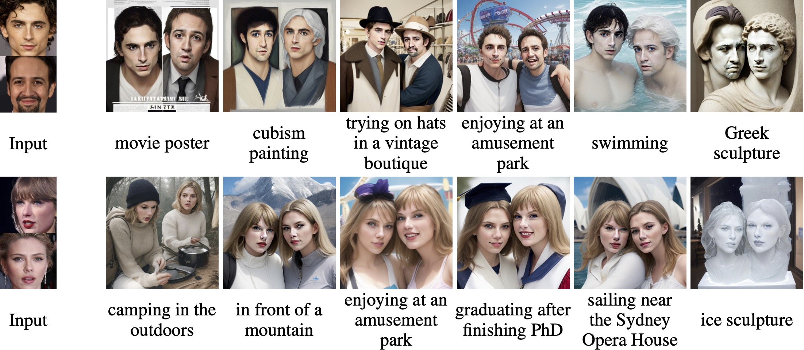

# RectifID

Code for NeurIPS 2024 paper [RectifID: Personalizing Rectified Flow with Anchored Classifier Guidance](https://arxiv.org/abs/2405.14677).

## New Updates

* [2024-06] Our code now supports SDXL. See `single_person_sdxl.py` and the [results](assets/single_person_sdxl.pdf).

  

## Requirements

* A GPU with a minimum of 12.5GB memory.
* Install insightface, onnxruntime-gpu, onnx2torch, kornia, deepface, and the dependencies of [PeRFlow](https://github.com/magic-research/piecewise-rectified-flow).
* Download [antelopev2](https://github.com/deepinsight/insightface/tree/master/python-package#model-zoo) and put the `.onnx` models in this folder.
* To use 2-rectified flow, add the parameter `callback_on_step_end` to `InstaFlow/code/pipeline_rf.py` according to [this code](https://github.com/huggingface/diffusers/blob/7e808e768a7305b3f8f9e981ad14f2de3598e9a6/src/diffusers/pipelines/stable_diffusion/pipeline_stable_diffusion.py#L757).

## Getting Started

* For single-face personalization, run the following command:

  ```python
  python single_person.py --model FLOW_NAME --ref REF_IMAGE --prompt PROMPT_LIST --out OUT_IMAGE_LIST
  ```

* For single-object customization,, run the following command:

  ```python
  python single_object.py --model FLOW_NAME --ref REF_IMAGE --ref_name REF_NAME --prompt PROMPT_LIST --out OUT_IMAGE_LIST
  ```
  
* Alternatively, you can explore the jupyter notebooks on your own:

  * single-person: `single_person_perflow.ipynb` and `single_person_2rflow.ipynb`
  * single-object: `single_object_perflow.ipynb` and `single_object_2rflow.ipynb`
  * multi-person: `multi_person_perflow.ipynb`
  * multi-object: `multi_object_perflow.ipynb`

* For face-centric generation, please include the trigger word "person" in your prompt, and optionally append ", face" at the end.

## Results

The following results were obtained with [PeRFlow](https://github.com/magic-research/piecewise-rectified-flow) based on Stable Diffusion 1.5:

| Single-person                              | Single-object                              |
| ------------------------------------------ | ------------------------------------------ |
|  |  |

| Multi-person                               | Multi-object                               |
| ------------------------------------------ | ------------------------------------------ |
|    |    |

Please see the paper appendix for more results.

## Citation

If you find this code useful, please consider citing:

```
@inproceedings{sun2024rectifid,
  title={RectifID: Personalizing Rectified Flow with Anchored Classifier Guidance},
  author={Sun, Zhicheng and Yang, Zhenhao and Jin, Yang and Chi, Haozhe and Xu, Kun and Xu, Kun and Chen, Liwei and Jiang, Hao and Song, Yang and Gai, Kun and Mu, Yadong},
  booktitle={Advances in Neural Information Processing Systems},
  year={2024}
}
```

## Acknowledgement

This code is based on [PeRFlow](https://github.com/magic-research/piecewise-rectified-flow) and [InstaFlow](https://github.com/gnobitab/InstaFlow), thanks to their efforts in open-sourcing.

Related projects worth checking out: [DOODL](https://github.com/salesforce/DOODL), [FlowGrad](https://github.com/gnobitab/FlowGrad), [DNO](https://github.com/korrawe/Diffusion-Noise-Optimization), [InitNO](https://github.com/xiefan-guo/initno), [DSG](https://github.com/LingxiaoYang2023/DSG2024), [D-Flow](https://arxiv.org/abs/2402.14017), [RFDS](https://github.com/yangxiaofeng/rectified_flow_prior), [ReNO](https://github.com/ExplainableML/ReNO).
